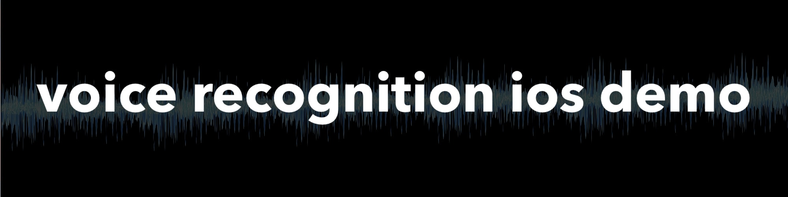

# voice recognition 

**Last Update: 29/September/2018.**

# ✍️ About 

Small demo app for `voice recognition` feature introduced in `iOS 10.0 SDK` using `Speech` framework. 

# 🌅 Pictures

# 👨‍💻 Author 
[Astemir Eleev](https://github.com/jVirus)

# 🔖 Licence
The project is available under [MIT Licence](https://github.com/Graveward/voice_recognition_demo-ios/blob/master/LICENSE)
